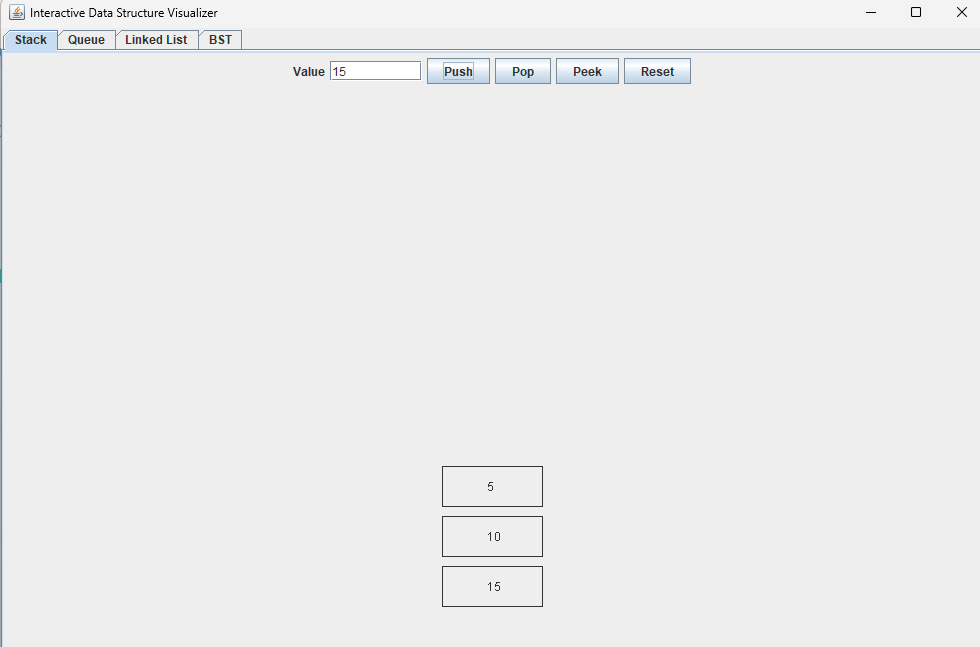
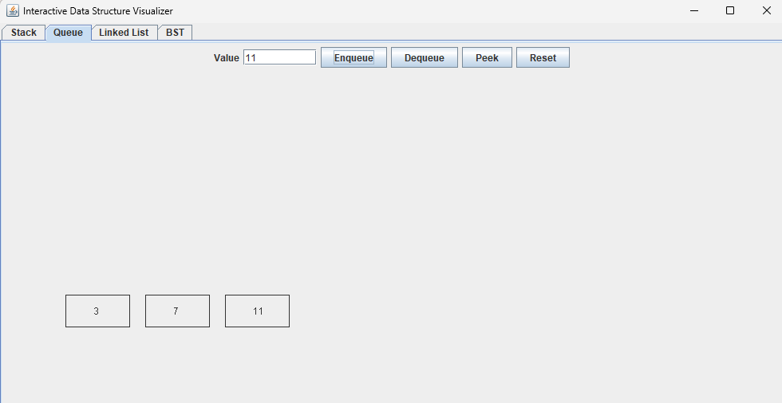
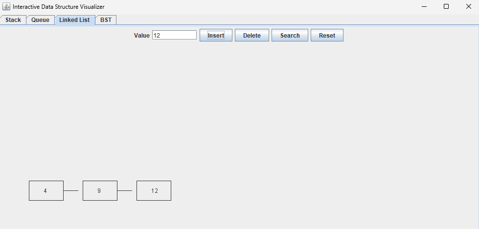
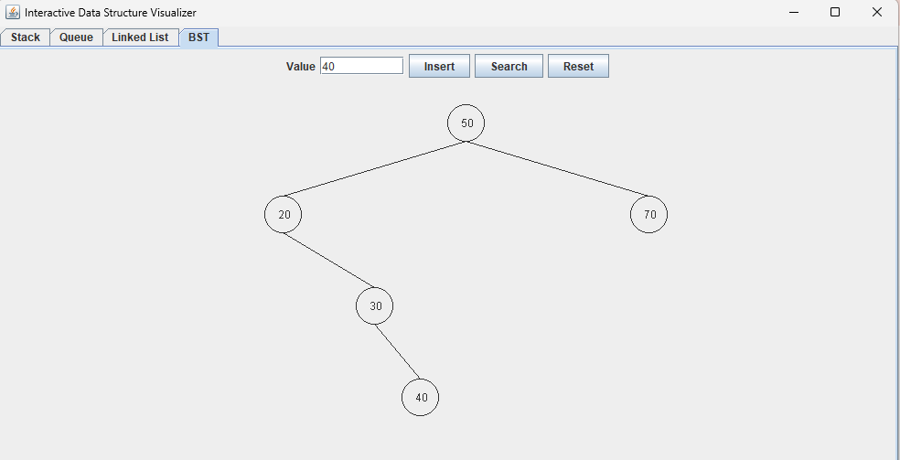

# Interactive Data Structure Visualizer

An interactive Java desktop application that visualizes core data structures through a graphical interface.

This project demonstrates how operations on common data structures such as stacks, queues, linked lists, and binary search trees behave internally through a visual representation.

---

## Features

### Stack
- Push elements
- Pop elements
- Peek at the top element
- Reset the stack
- Visual representation of LIFO behavior

### Queue
- Enqueue elements
- Dequeue elements
- Peek at the front element
- Reset the queue
- Visual representation of FIFO behavior

### Linked List
- Insert elements
- Delete elements
- Search elements
- Reset the list
- Visual node connections

### Binary Search Tree
- Insert nodes
- Search nodes
- Reset the tree
- Visual hierarchical structure

---

## Screenshots

### Stack


### Queue


### Linked List


### Binary Search Tree


---

## Tech Stack

- Java
- Swing (Java GUI toolkit)

---

## Project Structure

```
data-structure-visualizer-java
│
├── screenshots
│   ├── Stack.png
│   ├── Queue.png
│   ├── Linked List.png
│   └── BST.png
│
├── src
│   └── DataStructureVisualizer.java
│
├── .gitignore
├── README.md
└── out
```

---

## How to Run

Compile the program:

```
javac -d out src/DataStructureVisualizer.java
```

Run the application:

```
java -cp out DataStructureVisualizer
```

---

## Why I Built This

I built this project to strengthen my understanding of fundamental data structures by turning them into an interactive visual tool rather than just command-line implementations.

Seeing operations visually helps make concepts such as stack behavior, queue ordering, linked list traversal, and binary search tree structure much easier to understand.

---

## Future Improvements

- Sorting algorithm visualizations
- Heap visualization
- Animated node transitions
- Improved UI styling
- Additional data structures (graphs, hash tables)