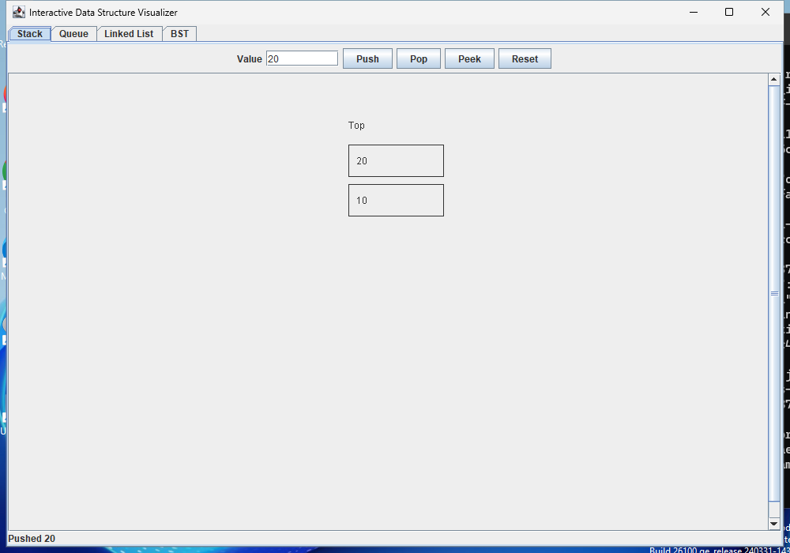
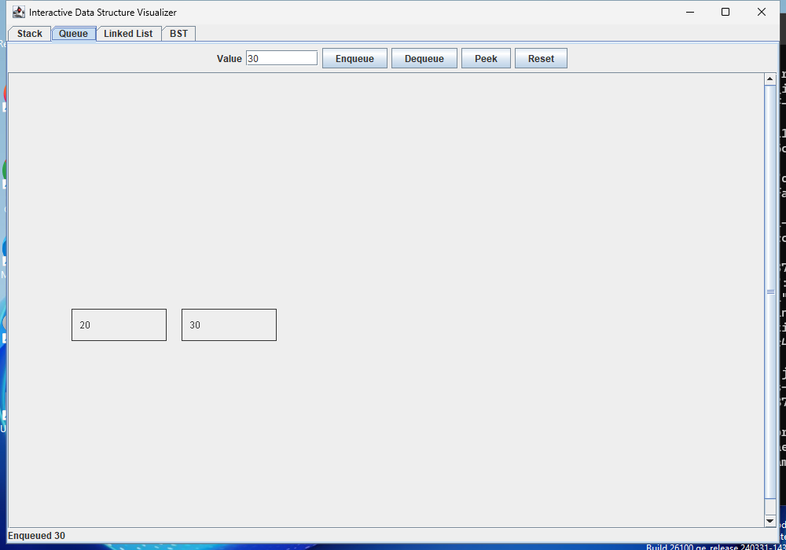
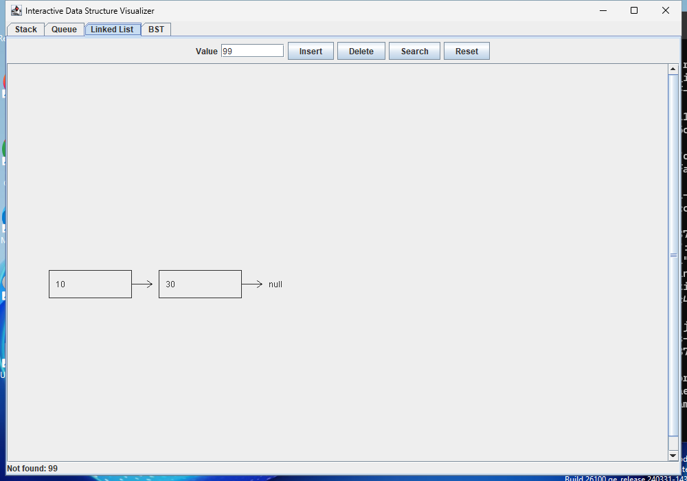
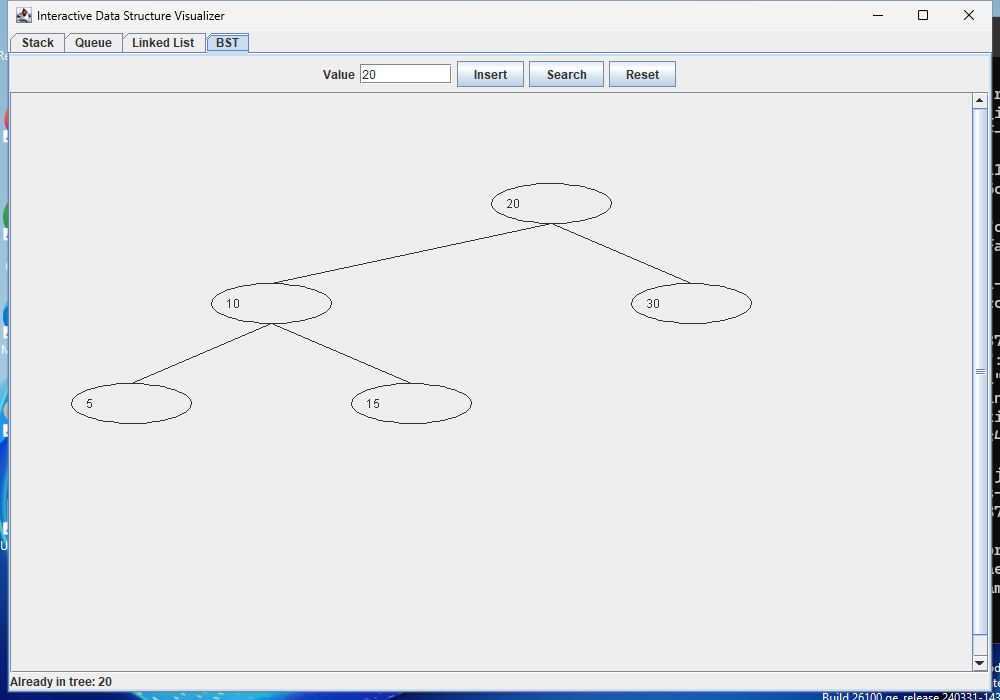

# Interactive Data Structure Visualizer

An interactive Java desktop application that visualizes core data structures through a graphical interface.

This project demonstrates how operations on common data structures such as stacks, queues, linked lists, and binary search trees behave internally through a visual representation.

---

## Features

### Stack
- Push elements
- Pop elements
- Peek at the top element
- Reset the stack
- Visual representation of LIFO behavior, with the newest item at the top

### Queue
- Enqueue elements
- Dequeue elements
- Peek at the front element
- Reset the queue
- Visual representation of FIFO behavior

### Linked List
- Insert elements
- Delete elements
- Search elements
- Reset the list
- Singly linked nodes with visible next pointers
- Reports when a value is not found

### Binary Search Tree
- Insert nodes
- Search nodes
- Reset the tree
- Visual hierarchical structure
- Reports duplicate values without inserting them again
- Scrollable drawings for larger structures

---

## Screenshots

### Stack
The newest value appears at the top.



### Queue
Values leave in the order they were added.



### Linked List
Deleting a node reconnects its neighbors. Missing values are reported in the status bar.



### Binary Search Tree
Values are arranged by their place in the tree. Duplicate inserts leave the tree unchanged.



---

## Tech Stack

- Java
- Swing (Java GUI toolkit)

---

## Project Structure

```
data-structure-visualizer-java
│
├── screenshots
│   ├── stack.png
│   ├── queue.png
│   ├── linked-list.png
│   └── bst.png
│
├── src
│   └── DataStructureVisualizer.java
│
├── .gitignore
├── README.md
└── tests
    ├── VisualizerTest.java
    └── DesktopWindowTest.java
```

---

## How to Run

Install a Java JDK (Java 17 or newer recommended), then run these commands from the project folder. A desktop display is needed to open the application.

Compile the program:

```
javac -d out src/DataStructureVisualizer.java
```

Run the application:

```
java -cp out DataStructureVisualizer
```

---

## Checks

The checks cover stack and queue ordering, linked-list deletion, duplicate tree values, invalid input, reset behavior, and offscreen drawing. They can run without a desktop display.

```sh
javac -d out src/DataStructureVisualizer.java tests/VisualizerTest.java
java "-Djava.awt.headless=true" -cp out VisualizerTest
```

Expected output: `Passed 27 checks.`

To check the full window on a desktop:

```sh
javac -d out src/DataStructureVisualizer.java tests/DesktopWindowTest.java
java -cp out DesktopWindowTest
```

This opens the app, exercises the buttons and tabs, checks scrolling and resizing, and confirms that closing the window ends the process. Screenshots are saved in `desktop-screenshots/`. GitHub Actions runs both sets of checks on Linux and Windows.

---

## Why I Built This

I built this project to strengthen my understanding of fundamental data structures by turning them into an interactive visual tool rather than just command-line implementations.

Seeing operations visually helps make concepts such as stack behavior, queue ordering, linked list traversal, and binary search tree structure much easier to understand.

---

## Future Improvements

- Sorting algorithm visualizations
- Heap visualization
- Animated node transitions
- Improved UI styling
- Additional data structures (graphs, hash tables)